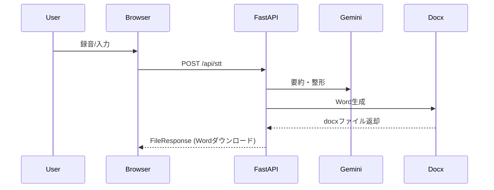

# 📘 議事録インタビューAI - Smart Minutes

音声入力で簡単に議事録を作成できるWebアプリケーションです。

---

## 🎯 概要

1. マイクで話すだけで自動文字起こし＆AI要約
2. 用途別モード（電力・保健・一般・自由入力）を選択可能
3. Gemini APIで議事録を自動整形
4. Word文書をワンクリックでダウンロード

---

## 💡 使い方

1. トップページで用途を選択
2. 質問に音声またはキーボードで回答
3. 「Word生成」ボタンでAI整形＆Wordダウンロード

---

## 📁 ディレクトリ構造

```
├── main.py                # アプリ本体
├── requirements.txt       # 依存パッケージ
├── render.yaml            # Renderデプロイ設定
├── app/
│   ├── config.py
│   ├── domain/
│   │   ├── question_flow.py
│   │   ├── summary.py
│   │   └── transcript.py
│   ├── services/
│   │   ├── gemini_service.py
│   │   ├── stt_service.py
│   │   ├── tts_service.py
│   │   └── docx_service.py
│   └── ui/
│       ├── templates/
│       │   ├── top.html
│       │   ├── index.html
│       │   └── bulk.html
│       └── static/
│           ├── style.css
│           ├── app.js
│           └── bulk.js
├── config_*.json          # 質問設定ファイル
```

---

## 📝 シーケンス図（主要フロー）



---
